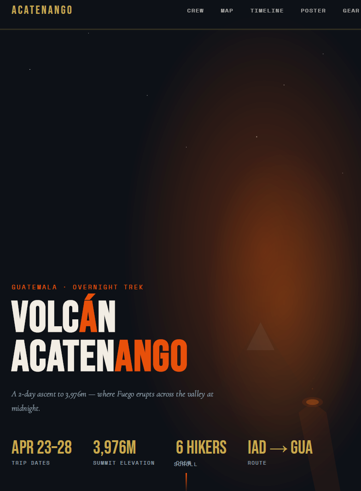

# 🌋 Acatenango Itinerary App

A full-stack Django web app built to plan and share a group hike of **Volcán Acatenango** in Guatemala. Features an interactive map, live summit weather, gear checklist, trip timeline, and a trip poster — all deployed and publicly accessible.

**🔗 Live Demo:** [acatenango-itinerary.onrender.com](https://acatenango-itinerary.onrender.com/)



---

## What This Is

Built as a personal project to coordinate a group trip to one of Guatemala's most iconic volcanoes (3,976m / 13,045ft). The app consolidates everything a hiking group needs — where to stop, what to pack, what the weather looks like at the summit — into a single shareable URL.

This project was an exercise in end-to-end ownership: designing the data model, building the frontend with interactive components, wiring up a live weather API, and deploying to a production environment on Render.

---

## Features

- 🗺️ **Interactive map** — Leaflet.js powered map with labeled stops along the route
- 📅 **Day-by-day timeline** — structured itinerary with key waypoints and timing
- 🌤️ **Live summit weather** — real-time conditions via Open-Meteo API (no key required), toggleable per session
- 🎒 **Gear checklist** — categorized packing list for the hike
- 🖼️ **Trip poster** — shareable visual summary of the adventure
- ⚙️ **Server-side feature flag** — `WEATHER_ENABLED` env var disables the weather widget entirely without code changes

---

## Tech Stack

| Layer | Tool |
|---|---|
| Backend | Django 4.2 |
| Frontend | Bootstrap 5 + Leaflet.js + vanilla JS |
| Database | SQLite (static data in `data.py`, no migrations needed) |
| Static files | WhiteNoise |
| Hosting | Render |
| Web server | Gunicorn |
| Weather API | Open-Meteo (free, no API key required) |

---

## Local Setup

```bash
# 1. Clone the repo and create a virtual environment
git clone https://github.com/kevin-ayalaaragon/acatenango-itinerary.git
cd acatenango-itinerary
python -m venv venv
source venv/bin/activate   # Windows: venv\Scripts\activate

# 2. Install dependencies
pip install -r requirements.txt

# 3. Copy env file
cp .env.example .env

# 4. Collect static files
python manage.py collectstatic --noinput

# 5. Run the development server
python manage.py runserver
```

Open [http://127.0.0.1:8000](http://127.0.0.1:8000) in your browser.

---

## Deployment (Render)

1. Push to GitHub and create a new **Web Service** on Render
2. **Build command:** `pip install -r requirements.txt && python manage.py collectstatic --noinput`
3. **Start command:** `gunicorn acatenango.wsgi --bind 0.0.0.0:$PORT`
4. **Environment variables:**
   - `SECRET_KEY` — Django secret key
   - `DEBUG=False`
   - `ALLOWED_HOSTS=your-domain.onrender.com`
   - `WEATHER_ENABLED=False` *(optional — disables weather widget server-side)*

---

## Customizing for Another Trek

All trip data lives in `itinerary/data.py`. Edit `STOPS`, `TIMELINE`, `GEAR`, and `STATS` to adapt this app for any hike or multi-day trip.

---

## Topics

`django` · `python` · `leaflet` · `bootstrap` · `travel` · `hiking` · `web-app` · `render` · `open-meteo`
